# My Tasks Management App

This project is a modern Angular application for task management featuring role-based access (ADMIN / USER), responsive UI, light/dark theme support, and robust data filtering and pagination.

> ⚙️ This project serves as the **frontend** for the [tasks-management REST API](https://github.com/nickTheof/spring-rest-tasks-app.git), a Spring Boot Java backend that handles authentication, task/user management, and data persistence.

> 🔗 Make sure the API is running to fully utilize the features of `myTasksManagementApp`.

---

## 🌟 Features

- 🔐 **Authentication & Authorization**
  - Login and "Forgot Password" via email
  - Role-based UI and logic (ADMIN / USER)
  - JWT authentication. Store token in localstorage. 

- 🎨 **Dark/Light Mode**
  - Toggle using Tailwind's dark mode with a class-based approach on `<html>`. Store user preference in localstorage.

- 👤 **Admin Panel**
  - Full access to user and task management
  - Sortable, paginated tables
  - Update user roles
  - Toggle user active status
  - Delete users or tasks

- 🧑‍💼 **User Mode**
  - View own tasks as card-based UI
  - Filter, sort, paginate tasks

- 📦 **Reusable Pagination & Filter Service**
  - Generic service handling sorting, filters, pagination for both users and tasks

- 🧩 **Responsive Design**
  - Mobile-friendly tables and layout using Tailwind CSS

---

## 🚀 Getting Started

### Prerequisites

- Node.js + Angular CLI
- Backend: [Spring Boot tasks-management REST API](https://github.com/nickTheof/spring-rest-tasks-app.git)

### Setup

```bash
git clone https://github.com/nickTheof/angular-task-management-app.git
cd angular-task-management-app
npm install
ng serve
```

Make sure your Spring Boot backend is running locally or hosted to provide API access.

---

## 🛠️ Tech Stack

- Angular
- Tailwind CSS
- RxJS Signals
- Font Awesome (icons)
- Spring Boot (backend)
- REST API Integration

---

## 🖼️ Screenshots

### 🔐 Authentication
  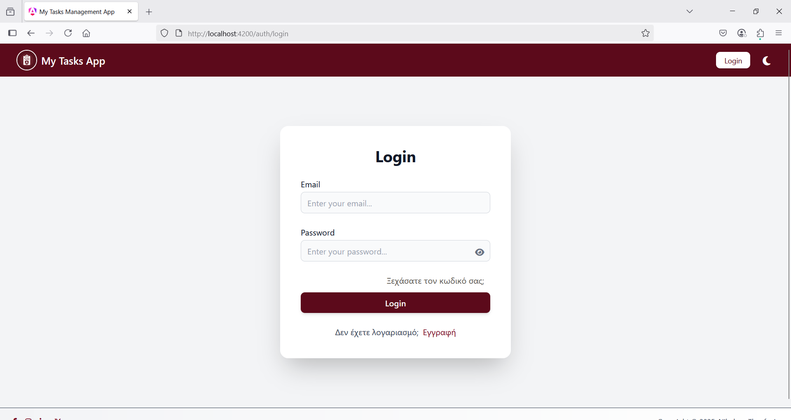
  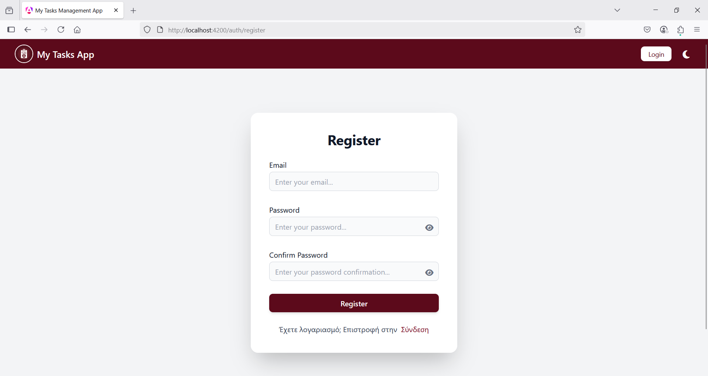
  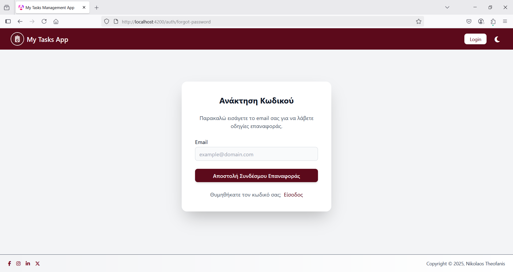
  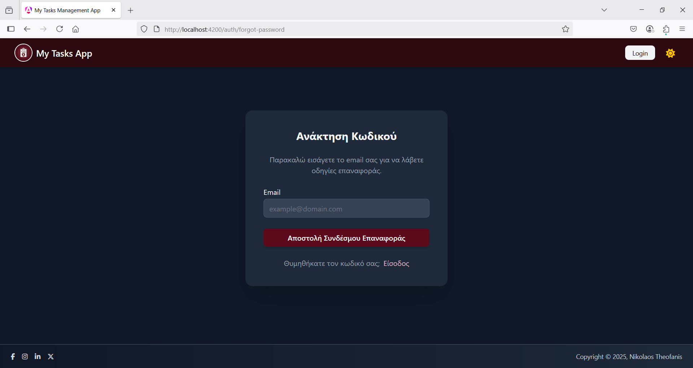

### 🎯 Dashboards
  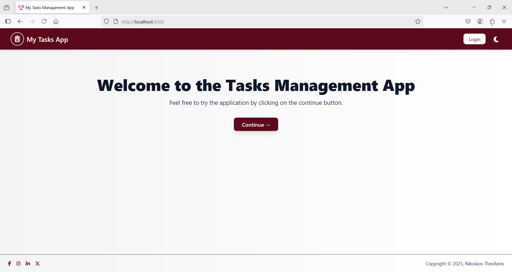
  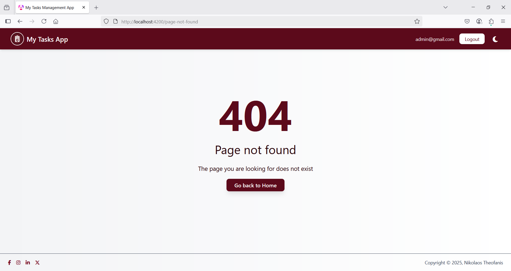
  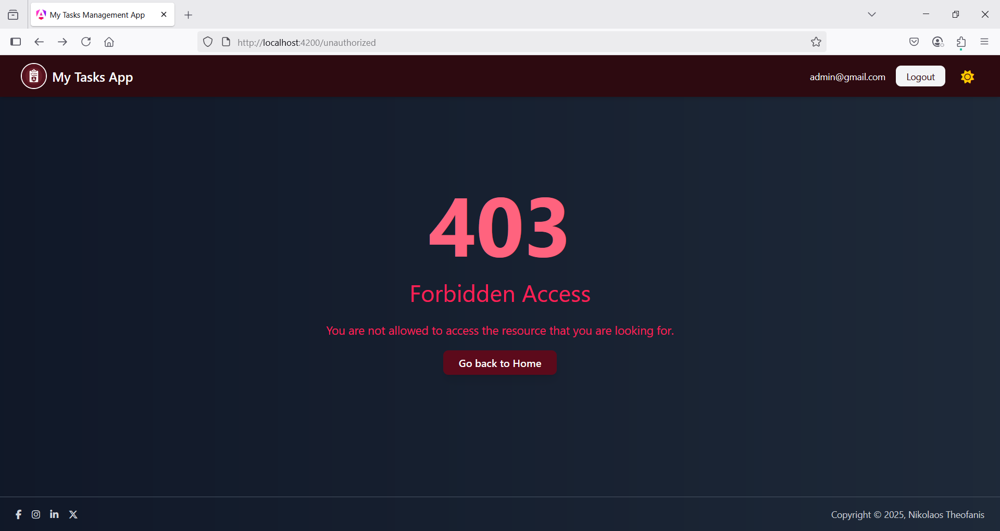
  
  
  
  
  
  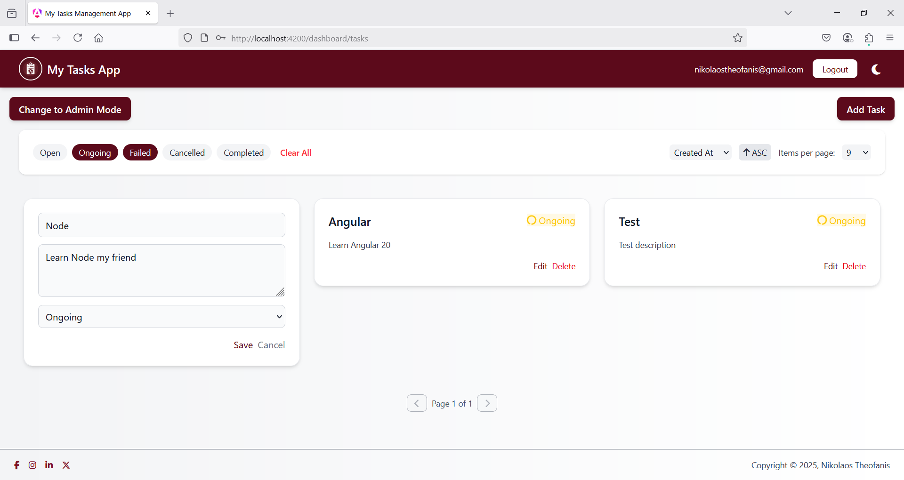
  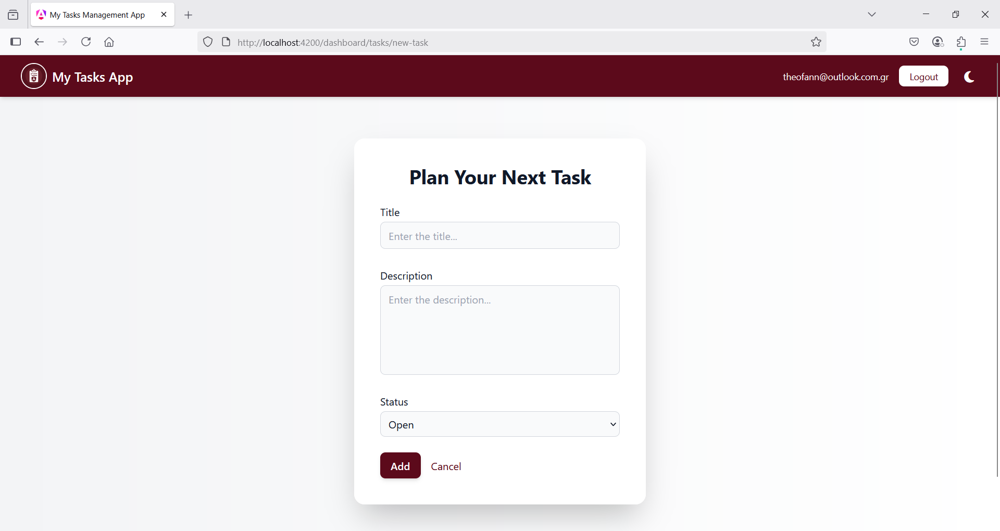
  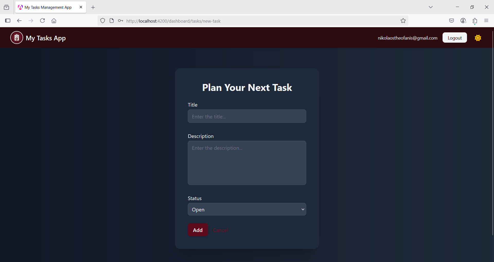
  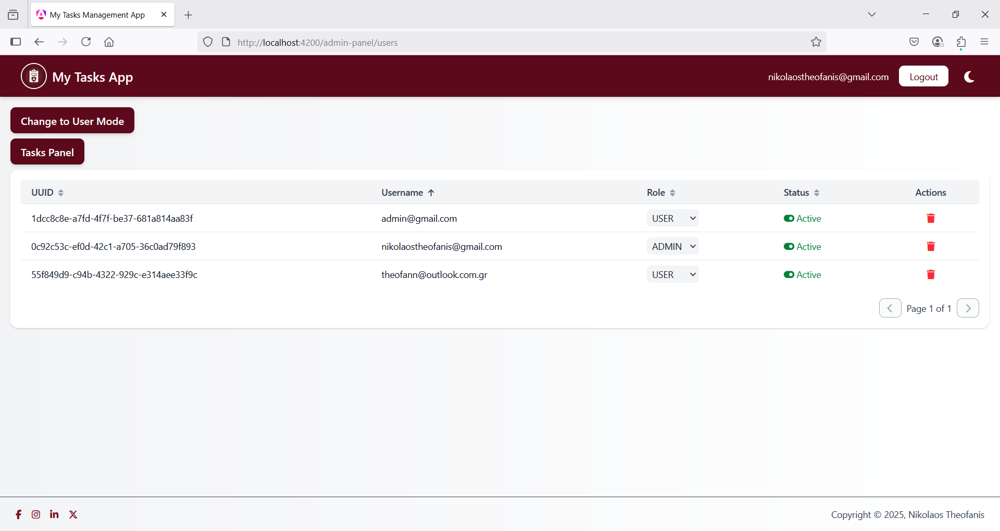
  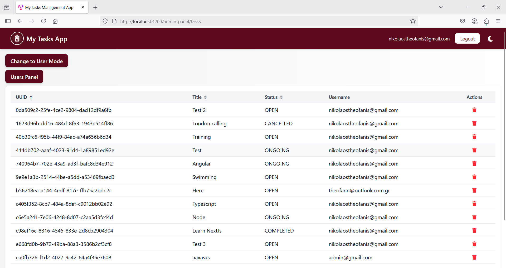

  


## 📄 License

This project is licensed under the MIT License - see the [LICENSE](licence.txt) file for details.
